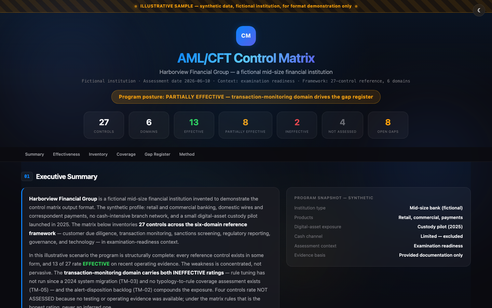
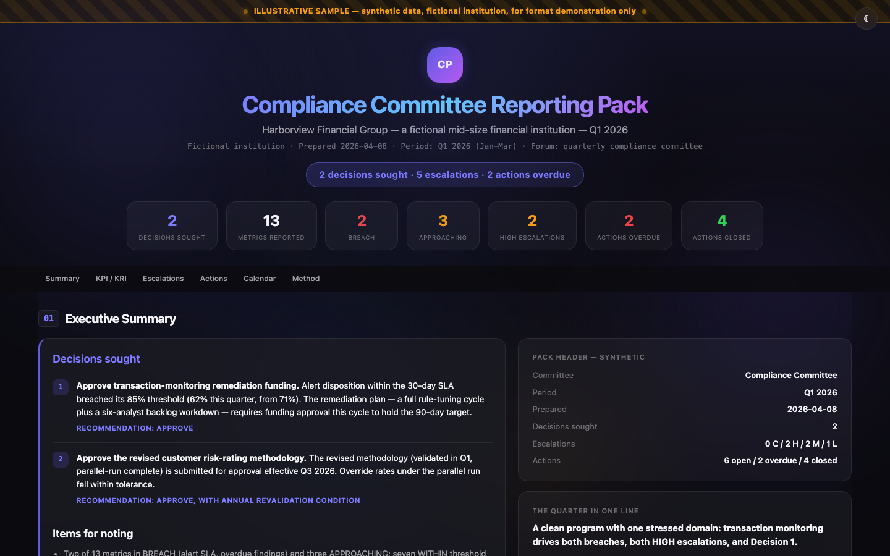

# analyst-toolkit

[](https://github.com/maxmoran23/analyst-toolkit/actions/workflows/validate.yml)

**A copy/paste library of prompts, runnable scoring engines, and output templates for AI-assisted analytical work at financial institutions — covering every function of a financial-crime organization, plus the regulatory, research, market, and quantitative work around it.**

> **New here, or not technical?** Start with **[How the system works](docs/how-the-system-works.md)** — a plain-English guide to the whole library for senior reviewers (what it is, what it can and cannot do, why its results can be trusted). Already know your function? Jump straight to your **[team hub](teams/)**.

---

## What this is

A library of reusable, paste-ready **prompt templates**, runnable **scoring engines**, and **document templates** for analytical work. Every prompt is a self-contained block you drop into an AI assistant — GitHub Copilot, Microsoft 365 Copilot, Claude, ChatGPT — to get a rigorous, structured, audit-defensible result: an entity risk assessment, a sanctions or PEP screen, a transaction-alert disposition, a SAR file/no-file memo, a control-testing workpaper, a data-lineage map, a new-product risk assessment, a policy gap analysis, a committee reporting pack, a regulatory intelligence scan, a fund-flow trace, a deep research report, a populated dashboard.

The library is written for **every team inside a financial-crime organization** — sanctions and screening, transaction monitoring, fraud, trade and communications surveillance, investigations and SAR, crypto/blockchain intelligence, KYC/CDD onboarding, third-party and correspondent banking, risk assessment, controls and independent testing, model risk and governance, data governance, new-product approval, and regulatory affairs — as well as the research, market, and quantitative work that sits alongside them, and for any analyst outside one doing comparable work. Fifteen [team hubs](teams/) index it by function. Nothing here assumes a specific firm, vendor, or toolchain.

It is **not a system to deploy**. There is nothing to install, no runtime, no scheduler, no data feed to connect. You browse, copy, paste, fill in the `{{PLACEHOLDERS}}`, and run. The work product is the prompt itself — the analytical method, the scoring rubric, the output structure, and the quality bar baked into each one. The one exception is [`frameworks/`](frameworks/): thirteen small, pure-standard-library scoring engines for the problems that are genuinely about volume, each shipping reproducible evidence of how accurately it performs. Those you run; everything else you paste.

Each template was extracted and generalized from a production autonomous-agent fleet, then stripped to its portable core — the part that travels to any assistant, any account, any machine.

> Looking for the architecture to *run* agents like these autonomously on a schedule — state, self-repair, budget management? That is the companion repo: **[Claude-Agent-Fleet](https://github.com/maxmoran23/Claude-Agent-Fleet)**. This repo is the content; that repo is the runtime.

---

## The two-file rule

Every feature in this library replicates with **at most two files** — and it is enforced in CI, not just promised:

| You attach | You get |
|------------|---------|
| **1 file** — any [`standalone/`](standalone/) file, or any prompt block from [`prompts/`](prompts/) | The full analysis: method, scoring rubric, structured output. Standalone files also include the multi-format renderer. |
| **2 files** — any prompt + [`BASE.md`](BASE.md) | Everything above **plus** the full quality system: audit-defensible voice, analytical discipline, per-deliverable quality floor, and the Word / Excel / PDF / interactive-HTML renderer. |

There is never a third file. [`BASE.md`](BASE.md) is the entire 4-file methodology consolidated into one attachable document — built for environments with no file system, no memory, and no repo access: a locked-down work machine, a Copilot chat, a one-shot share with a teammate. Every prompt block is fully self-contained as pasted; links inside prompt files are browse-time navigation, never run-time dependencies. A CI job ([`validate.yml`](.github/workflows/validate.yml)) fails the build if any prompt leaks a file reference into its paste payload, names a companion other than `BASE.md`, or exceeds the two-file budget.


<table>
  <tr>
    <td width="50%"></td>
    <td width="50%"></td>
  </tr>
  <tr>
    <td width="50%"></td>
    <td width="50%"></td>
  </tr>
</table>

*Above: outputs and templates from the toolkit — a sample entity risk assessment (one prompt plus one template), a regulatory-landscape view, the lightweight deep-dive dashboard template, and rendered samples from the controls category (27-control AML/CFT matrix, quarterly committee reporting pack). [See all samples](samples/) · [dashboard templates](output-templates/dashboards/).*

---

## What's inside

| Directory | What's in it |
|-----------|--------------|
| **[`BASE.md`](BASE.md)** | **The one companion file** — the entire methodology framework (voice + method + quality bar + renderer) consolidated into a single attachable document. Any prompt + `BASE.md` = full toolkit quality. Generated from `methodology/`; CI keeps it in sync. |
| **[`methodology/`](methodology/)** | **The 4-file framework base** — analytical patterns, audit-defensible writing voice, quality standards per output type, and the multi-format report-templates renderer. Load all four as Copilot agent / Claude Project / ChatGPT custom GPT instructions once; every task becomes a thin prompt after that. Prefer one file? Use [`BASE.md`](BASE.md). |
| **[`standalone/`](standalone/)** | **Single-file copy/paste prompts** — each one a complete instruction set, no cross-references, no other files needed; embeds the same renderer as `methodology/report-templates.md`. Best for one-off use or sharing one file with a teammate |
| **[`prompts/`](prompts/)** | 68 paste-ready analytical prompt templates across 13 categories — the broader library; each file pairs a prompt block with how-to and tuning sections |
| **[`output-templates/`](output-templates/)** | Document scaffolds — interactive dashboards, PDF reports, compliance documents, communications |
| **[`samples/`](samples/)** | Rendered example outputs with previews — what the prompts and templates actually produce |
| **[`reference/`](reference/)** | Domain cheat-sheets — AML typologies, blockchain entity typologies, compliance, audit, regulatory, financial analysis |
| **[`quant/`](quant/)** | A dependency-free Python quant library — VaR, Sharpe, Kelly, Monte Carlo, DCF, drawdown |
| **[`quant-jvm/`](quant-jvm/)** | Kotlin/JVM port of `quant/` — same math, same JSON I/O contract, verified by cross-language parity tests |
| **[`frameworks/`](frameworks/)** | **13 runnable scoring engines with validation evidence** — pure-stdlib reference engines for the financial-crime problems that are a measurable scoring/triage/matching problem (sanctions and PEP screening, transaction monitoring, threshold tuning, customer risk rating, adverse media, on-chain KYT, on-chain OSINT evidence, watchlist knowledge base, case QA, NPA product risk, data-quality rules, attribute sampling), each with a seeded synthetic-data generator and a harness that emits reproducible accuracy evidence (recall, false-positive reduction, threshold sweeps) and fails the build on a false-negative-safety breach. A different artifact class from the paste-prompts; runnable, multi-file. |
| **[`teams/`](teams/)** | **Start here by your function** — 15 hub pages, one per team across the financial-crime organization (sanctions/screening, transaction monitoring, fraud, surveillance, crypto, KYC, investigations & SAR, third-party & correspondent, risk assessment, controls/testing, model governance, data governance, new-product approval, regulatory affairs, adverse media), each bundling the relevant prompts, frameworks, references, and templates in one place, in plain English. Pure navigation over the by-type folders. |
| **[`docs/`](docs/)** | Usage guides — the Copilot copy/paste workflow, running on any assistant, and **[how-the-system-works.md](docs/how-the-system-works.md)**: a plain-English walkthrough of the whole library for non-technical senior reviewers. |

---

## Three ways in

The toolkit supports three workflows. Pick the one that matches how you use AI assistants day to day.

### 1. Methodology base + thin prompts (set up once)

**Best for:** a work machine where you'll do many varied analytical tasks, and want every output to come out at the same quality bar without re-pasting a long prompt each time.

Load **[`BASE.md`](BASE.md)** (the four methodology files in one document) — or the four files from **[`methodology/`](methodology/)** individually — as your assistant's base instructions: Copilot agent custom instructions, Claude Project custom instructions, ChatGPT custom GPT instructions, or `.github/copilot-instructions.md` in a working repo. The four files cover **how to think** ([`analytical-patterns.md`](methodology/analytical-patterns.md)), **how to write it down** ([`audit-defensible-writing.md`](methodology/audit-defensible-writing.md)), **when it's done** ([`output-quality-standards.md`](methodology/output-quality-standards.md)), and **how to render it as Word / Excel / PDF / HTML** ([`report-templates.md`](methodology/report-templates.md)).

Then every task is a thin prompt that scopes the work; the four files supply the framework:

> *"Do an 8-domain entity risk assessment on [ENTITY]. Render as a Word doc."*
>
> *"Compare these three vendors on [criteria]. Render as an Excel workbook."*
>
> *"Triage this transaction alert. [profile + transactions]. Render as both Word and PDF."*

The methodology files apply the voice, the analytical discipline, the quality floor, and the rendering form. See [`methodology/report-templates.md`](methodology/report-templates.md) for more thin-prompt patterns.

### 2. Single-file standalone (no setup, copy/paste once per task)

**Best for:** one-off use, sharing one file with a teammate who has no setup, or demoing the "look at the quality difference" pattern.

Use a file from **[`standalone/`](standalone/)**. Every file there is fully self-contained: the whole file *is* the prompt, no markdown links to other files in the repo, each one starts with a Preflight step (assistant explicitly checks your inputs and asks for clarification before producing anything partial), and each one embeds the same multi-format renderer as `methodology/report-templates.md`. Paste one file, supply your inputs, optionally ask for a Word / Excel / PDF / HTML deliverable — all from that single paste. Covers universal analyst work (document summary, comparison matrix, meeting prep, decision memo, weekly digest, action items), the flagship financial-crime / intelligence prompts, and the assurance templates (control matrix builder, committee reporting pack).

### 3. Browse the catalog (find a prompt, copy the block)

**Best for:** discovering what the library covers, picking the right template for a new task, or seeing how prompts pair with samples and reference material.

Use **[`prompts/`](prompts/)** (catalog below). Each file has:

1. A summary table — when to use it and what it produces.
2. A single fenced ```text``` block under `## The prompt` — copy that, fill the `{{PLACEHOLDERS}}`, paste into any assistant.
3. How-to-use, output-structure, and tuning sections for the human reader.

Need a formatted deliverable from this workflow? Attach **[`BASE.md`](BASE.md)** alongside the prompt — its Part 4 is the Word / Excel / PDF / HTML renderer. Two files, never more. (Browsing for document scaffolds directly? They live in [`output-templates/`](output-templates/).)

Full workflow, including the Copilot copy/paste loop and getting output into clean files: **[docs/using-with-copilot.md](docs/using-with-copilot.md)**.

---

## Prompt catalog

68 prompts across 13 categories. The financial-crime categories cover a full analytical lifecycle — **detect** (typology mapping) → **monitor** (alert triage, sanctions and PEP screening, on-chain screening) → **investigate** (fund-flow tracing, UBO unwinding, link analysis) → **decide** (SAR file/no-file) → **quality-check** (case QA) → **report** (investigation narrative). The controls, data, and regulatory categories cover the assurance lifecycle around it — **document** (EWRA, control matrix, risk register) → **test** (testing workpaper, QA scorecard) → **govern** (model governance and validation, data quality, lineage) → **track** (issue remediation) → **report and respond** (committee pack, policy gap analysis, exam response). The `npa/` category runs the same discipline forward in time, before a product generates its first alert.

### Financial crime & compliance — [`prompts/compliance/`](prompts/compliance/)
| Prompt | What it does |
|--------|--------------|
| [entity-risk-assessment](prompts/compliance/entity-risk-assessment.md) | 8-domain weighted risk assessment of an entity — 0-100 composite, 5-tier rating, disposition |
| [sanctions-watchlist-screen](prompts/compliance/sanctions-watchlist-screen.md) | Screen a name, entity, or address against OFAC + EU/UN/UK lists with hit disposition |
| [pep-screening-disposition](prompts/compliance/pep-screening-disposition.md) | Disposition a PEP alert on two axes — right party, and materially in-scope status |
| [typology-detection-mapping](prompts/compliance/typology-detection-mapping.md) | Decompose an AML typology into red-flag indicators and transaction-monitoring rule logic |
| [alert-triage](prompts/compliance/alert-triage.md) | Work a transaction-monitoring alert to a documented close / escalate / refer disposition |
| [investigation-narrative](prompts/compliance/investigation-narrative.md) | Draft a chronological, evidence-sourced narrative of investigated activity |
| [sar-decisioning](prompts/compliance/sar-decisioning.md) | Work an investigation through the elements-of-suspicion checklist to a documented file / no-file memo |
| [case-qa-review](prompts/compliance/case-qa-review.md) | Second-line QA of a completed case file — critical checks, deficiency register, PASS / REMEDIATE / REWORK |
| [ubo-beneficial-ownership](prompts/compliance/ubo-beneficial-ownership.md) | Unwind an ownership chain — effective-ownership math, control prongs, opacity red flags |
| [network-link-analysis](prompts/compliance/network-link-analysis.md) | Map entity relationships into shared-attribute clusters, hubs, and flow-through patterns |
| [periodic-review-triggers](prompts/compliance/periodic-review-triggers.md) | Triage a periodic-review backlog — event vs calendar triggers, weighted prioritization |
| [customer-file-review](prompts/compliance/customer-file-review.md) | Review a customer risk file for completeness and risk-rating defensibility |

### Fraud — [`prompts/fraud/`](prompts/fraud/)
| Prompt | What it does |
|--------|--------------|
| [app-fraud-triage](prompts/fraud/app-fraud-triage.md) | Classify an authorized-push-payment scam and disposition it with a liability framing |
| [wire-fraud-disposition](prompts/fraud/wire-fraud-disposition.md) | Disposition a flagged wire — hold, release, recall, or escalate, with the verification step named |
| [check-fraud-analysis](prompts/fraud/check-fraud-analysis.md) | Classify a check or deposit fraud case and size loss exposure against the funds-availability clock |
| [mule-account-review](prompts/fraud/mule-account-review.md) | Assess an account for money-mule indicators, with a network-expansion list |
| [fraud-typology-mapping](prompts/fraud/fraud-typology-mapping.md) | Translate a named fraud scheme into detection-rule logic and control mappings |

### Trade & communications surveillance — [`prompts/surveillance/`](prompts/surveillance/)
| Prompt | What it does |
|--------|--------------|
| [trade-surveillance-review](prompts/surveillance/trade-surveillance-review.md) | Triage a trade-surveillance alert — manipulation pattern vs legitimate-strategy alternatives |
| [comms-surveillance-review](prompts/surveillance/comms-surveillance-review.md) | Read a flagged e-comms item in context and classify the conduct or market-integrity risk |
| [market-abuse-case](prompts/surveillance/market-abuse-case.md) | Build an element-by-element case narrative for suspected insider dealing or manipulation |

### ABC, third-party & correspondent banking — [`prompts/third-party/`](prompts/third-party/)
| Prompt | What it does |
|--------|--------------|
| [vendor-due-diligence](prompts/third-party/vendor-due-diligence.md) | Onboarding or periodic vendor diligence — domain scorecard, residual tier, required mitigations |
| [abc-risk-assessment](prompts/third-party/abc-risk-assessment.md) | Anti-bribery & corruption exposure assessment for a relationship, transaction, or intermediary |
| [correspondent-nested-risk](prompts/third-party/correspondent-nested-risk.md) | Score a respondent relationship and its downstream / nested access risk |
| [tbml-redflag-analysis](prompts/third-party/tbml-redflag-analysis.md) | Screen a trade-finance transaction for TBML red flags; tiered disposition memo |

### Blockchain intelligence — [`prompts/blockchain/`](prompts/blockchain/)
| Prompt | What it does |
|--------|--------------|
| [onchain-sanctions-monitor](prompts/blockchain/onchain-sanctions-monitor.md) | Screen blockchain addresses for sanctions, mixer, and AML-typology exposure |
| [fund-flow-tracing](prompts/blockchain/fund-flow-tracing.md) | Trace funds hop by hop across a chain — counterparties, mixers, exchanges, attribution |
| [block-explorer-osint](prompts/blockchain/block-explorer-osint.md) | Convert public explorer data into a provenance-stamped evidence annex with a reconciliation tie-out |
| [defi-protocol-risk](prompts/blockchain/defi-protocol-risk.md) | Score a DeFi protocol on TVL, yield, contract, governance, and bridge risk |
| [token-compliance-screen](prompts/blockchain/token-compliance-screen.md) | Screen a digital asset on both thesis quality and AML red flags |

### Regulatory — [`prompts/regulatory/`](prompts/regulatory/)
| Prompt | What it does |
|--------|--------------|
| [regulatory-intelligence-scan](prompts/regulatory/regulatory-intelligence-scan.md) | Severity-rated briefing on what changed in a regulatory landscape |
| [geopolitical-risk-monitor](prompts/regulatory/geopolitical-risk-monitor.md) | Per-jurisdiction sanctions, conflict, and regulatory-risk scoring |
| [obligation-extraction](prompts/regulatory/obligation-extraction.md) | Turn a regulation or filing into a structured register of obligations and deadlines |
| [policy-gap-analysis](prompts/regulatory/policy-gap-analysis.md) | Clause-level gap analysis of an internal policy against a regulation, with traceability matrix |
| [exam-response-pack](prompts/regulatory/exam-response-pack.md) | Parse an examination or information request into a response pack with evidence mapping and QC checklist |

### Controls, testing & governance — [`prompts/controls/`](prompts/controls/)
| Prompt | What it does |
|--------|--------------|
| [control-matrix-builder](prompts/controls/control-matrix-builder.md) | Build a six-domain AML/CFT control inventory — 27-control reference framework, gap register, remediation view |
| [risk-register-builder](prompts/controls/risk-register-builder.md) | Build a compliance risk register — inherent L×I scoring, residual ratings, appetite comparison, dual heat maps |
| [ewra-builder](prompts/controls/ewra-builder.md) | Build the enterprise-wide risk assessment — business-line inherent factors, control overlay, residual grid, board summary |
| [independent-testing-workpaper](prompts/controls/independent-testing-workpaper.md) | Design and document a control test to audit standard — sample methodology, exceptions, effectiveness conclusion |
| [qa-review-scorecard](prompts/controls/qa-review-scorecard.md) | Score completed work items against a weighted QA rubric — pass rate, error taxonomy, coaching themes |
| [issue-remediation-tracker](prompts/controls/issue-remediation-tracker.md) | Normalize findings into an issue register — action-plan QC, sustainability tests, closure-evidence standards |
| [model-governance-review](prompts/controls/model-governance-review.md) | Assess a model, rule set, or AI-assisted tool against model-risk-management expectations |
| [model-validation-workpaper](prompts/controls/model-validation-workpaper.md) | Independent validation workpaper along the SR 11-7 pillars — findings register, documented effective challenge |
| [data-quality-review](prompts/controls/data-quality-review.md) | Assess a dataset across six quality dimensions with source-to-use lineage and a remediation register |

### Data governance — [`prompts/data-governance/`](prompts/data-governance/)
| Prompt | What it does |
|--------|--------------|
| [cde-inventory](prompts/data-governance/cde-inventory.md) | Build a critical-data-element inventory from consuming-process criticality — owner, source of truth, thresholds |
| [data-lineage-mapping](prompts/data-governance/data-lineage-mapping.md) | Map one CDE from origin to every consuming process — controlled vs uncontrolled hops, break-risk register |
| [dq-rule-authoring](prompts/data-governance/dq-rule-authoring.md) | Translate a quality requirement into named, testable rules across five dimensions, with thresholds |
| [data-incident-triage](prompts/data-governance/data-incident-triage.md) | Triage a data break that hit financial-crime systems — blast radius, lookback, compensating controls |

### New-product approval — [`prompts/npa/`](prompts/npa/)
| Prompt | What it does |
|--------|--------------|
| [npa-risk-assessment](prompts/npa/npa-risk-assessment.md) | Nine-factor financial-crime risk assessment of a proposed product — tier, raise-only floors, approval routing |
| [product-launch-readiness](prompts/npa/product-launch-readiness.md) | Verify every approval condition against evidence — GO / GO-WITH-CONDITIONS / NO-GO |
| [post-implementation-review](prompts/npa/post-implementation-review.md) | Projected-vs-observed review at the committed date — close, extend, remediate, or escalate |

### Research — [`prompts/research/`](prompts/research/)
| Prompt | What it does |
|--------|--------------|
| [deep-research-storm](prompts/research/deep-research-storm.md) | Multi-perspective deep research into a cited long-form article |
| [cross-source-synthesis](prompts/research/cross-source-synthesis.md) | Meta-analysis across many sources — themes, contradictions, blind spots |
| [idea-generation](prompts/research/idea-generation.md) | Cross-domain idea generation, scored on an opportunity rubric |
| [calibration-debate](prompts/research/calibration-debate.md) | Steelman both sides of a thesis, then score its defensibility |
| [research-translation-scan](prompts/research/research-translation-scan.md) | Filter a research stream for signal, translate to practical implications |
| [frontier-scan](prompts/research/frontier-scan.md) | Track speculative research with strict evidence-tiering and forced counter-arguments |
| [futures-projection](prompts/research/futures-projection.md) | Year-by-year multi-metric scenario forecast with confidence bands |

### Market & economic — [`prompts/market/`](prompts/market/)
| Prompt | What it does |
|--------|--------------|
| [market-sentiment-tracker](prompts/market/market-sentiment-tracker.md) | Synthesize price, sentiment, and news into a market-narrative read |
| [macro-regime-monitor](prompts/market/macro-regime-monitor.md) | Classify the current macro regime from growth/inflation/liquidity indicators |
| [prediction-market-signal](prompts/market/prediction-market-signal.md) | Mine prediction markets for implied probabilities and flag divergences |
| [simulated-portfolio-manager](prompts/market/simulated-portfolio-manager.md) | A hypothetical portfolio-simulation exercise with risk rules and attribution |
| [intelligence-dashboard-aggregator](prompts/market/intelligence-dashboard-aggregator.md) | Consolidate multiple feeds into one structured dashboard view |

### Intelligence briefs — [`prompts/briefs/`](prompts/briefs/)
| Prompt | What it does |
|--------|--------------|
| [intelligence-brief](prompts/briefs/intelligence-brief.md) | A prioritized, scannable briefing — morning / midday / afternoon / evening variants |
| [weekly-roundup](prompts/briefs/weekly-roundup.md) | A weekly review with a multi-dimension performance scorecard |
| [breaking-news-scan](prompts/briefs/breaking-news-scan.md) | A terse, relevance-filtered breaking-news headline scan |
| [committee-reporting-pack](prompts/briefs/committee-reporting-pack.md) | Assemble a governance-committee reporting pack — KPI/KRI dashboard, escalations, prior-action tracker |

### Specialty — [`prompts/specialty/`](prompts/specialty/)
| Prompt | What it does |
|--------|--------------|
| [expected-value-analysis](prompts/specialty/expected-value-analysis.md) | Compute edge and expected value, size with the Kelly criterion, with risk-of-ruin context |
| [local-market-analytics](prompts/specialty/local-market-analytics.md) | Local real-estate market analytics — tracking, transformation signals, multi-scenario projection |

---

## Design principles

Every prompt in this library follows the same discipline — documented in full under [`methodology/`](methodology/):

- **Audit-defensible.** Every claim carries a source. Observed fact, allegation, and projection are never blended.
- **Two-file ceiling, machine-enforced.** Any feature replicates with at most one prompt + [`BASE.md`](BASE.md). CI fails if a paste payload references another file or any prompt names a different companion.
- **Runs anywhere.** Every prompt is self-contained and assistant-agnostic — no tool, integration, memory, or specific product required. If a capability is missing it degrades gracefully and asks for what it needs. See [running on any assistant](docs/running-on-any-assistant.md).
- **Structured output.** Each prompt specifies an exact output format — scorecards, severity tiers, confidence ratings — so results are comparable and reusable.
- **Honest about gaps.** "No adverse findings" and "quiet period" are valid results. Thin evidence lowers the confidence rating; it does not get filled with inference.
- **Vendor-skeptical.** Self-reported metrics and vendor claims are treated as unverified until corroborated.
- **No fabrication.** An unverifiable claim is labeled or omitted — never invented.

---

## About

This toolkit was generalized from a production autonomous-agent fleet operated at the intersection of crypto/AML compliance work and hands-on AI system design. That compliance background is why the templates lean toward structured severity frameworks, audit-defensible documentation, and systematic evidence-based analysis — those are the default operating principles here, not decoration.

Everything in this repository is generic and reusable. There is no proprietary, employer-specific, or non-public content — only method, structure, and quality bar.

## License

MIT — see [LICENSE](LICENSE). Use these freely; adapt them to your work.
