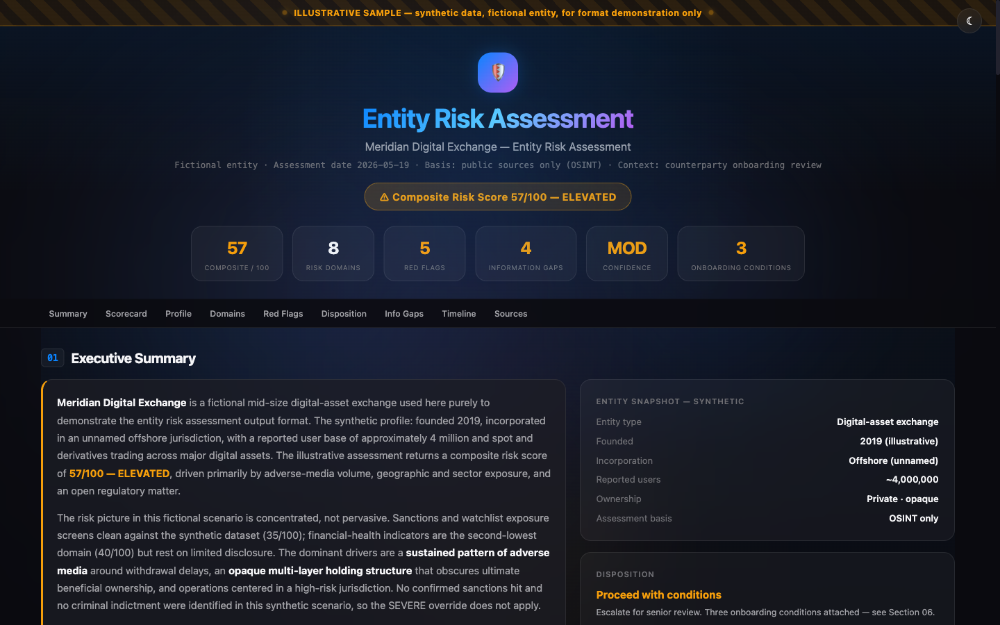
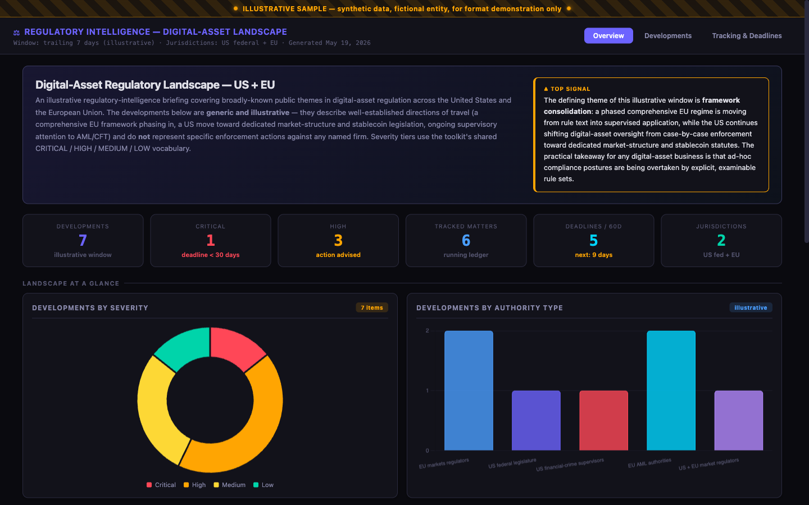
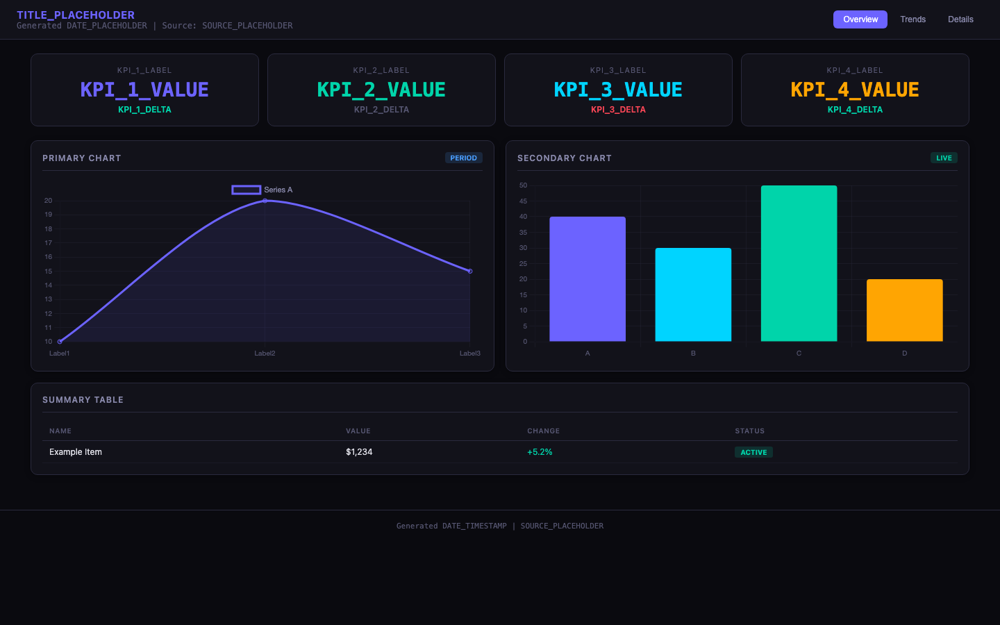

# analyst-toolkit

[](https://github.com/maxmoran23/analyst-toolkit/actions/workflows/validate.yml)

**A copy/paste library of prompts and output templates for AI-assisted analytical work — built around a financial-crime, compliance, and blockchain-intelligence core, and extending into regulatory, research, market, and quantitative analysis.**

---

## What this is

A library of reusable, paste-ready **prompt templates** and **document templates** for analytical work. Every prompt is a self-contained block you drop into an AI assistant — GitHub Copilot, Microsoft 365 Copilot, Claude, ChatGPT — to get a rigorous, structured, audit-defensible result: an entity risk assessment, a sanctions screen, a transaction-alert disposition, a regulatory intelligence scan, a fund-flow trace, a deep research report, a populated dashboard.

It is **not a framework to run**. There is nothing to install, no runtime, no scheduler. You browse, copy, paste, fill in the `{{PLACEHOLDERS}}`, and run. The work product is the prompt itself — the analytical method, the scoring rubric, the output structure, and the quality bar baked into each one.

Each template was extracted and generalized from a production autonomous-agent fleet, then stripped to its portable core — the part that travels to any assistant, any account, any machine.

> Looking for the architecture to *run* agents like these autonomously on a schedule — state, self-repair, budget management? That is the companion repo: **[Claude-Agent-Fleet](https://github.com/maxmoran23/Claude-Agent-Fleet)**. This repo is the content; that repo is the runtime.

---

## The two-file rule

Every feature in this library replicates with **at most two files** — and it is enforced in CI, not just promised:

| You attach | You get |
|------------|---------|
| **1 file** — any [`standalone/`](standalone/) file, or any prompt block from [`prompts/`](prompts/) | The full analysis: method, scoring rubric, structured output. Standalone files also include the multi-format renderer. |
| **2 files** — any prompt + [`BASE.md`](BASE.md) | Everything above **plus** the full quality system: audit-defensible voice, analytical discipline, per-deliverable quality floor, and the Word / Excel / PDF / interactive-HTML renderer. |

There is never a third file. [`BASE.md`](BASE.md) is the entire 4-file methodology consolidated into one attachable document — built for environments with no file system, no memory, and no repo access: a locked-down work machine, a Copilot chat, a one-shot share with a teammate. Every prompt block is fully self-contained as pasted; links inside prompt files are browse-time navigation, never run-time dependencies. A CI job ([`validate.yml`](.github/workflows/validate.yml)) fails the build if any prompt leaks a file reference into its paste payload, names a companion other than `BASE.md`, or exceeds the two-file budget.



<table>
  <tr>
    <td width="50%"></td>
    <td width="50%"></td>
  </tr>
</table>

*Above: outputs and templates from the toolkit — a sample entity risk assessment (one prompt plus one template), a regulatory-landscape view, and the lightweight deep-dive dashboard template. [See all samples](samples/) · [dashboard templates](output-templates/dashboards/).*

---

## What's inside

| Directory | What's in it |
|-----------|--------------|
| **[`BASE.md`](BASE.md)** | **The one companion file** — the entire methodology framework (voice + method + quality bar + renderer) consolidated into a single attachable document. Any prompt + `BASE.md` = full toolkit quality. Generated from `methodology/`; CI keeps it in sync. |
| **[`methodology/`](methodology/)** | **The 4-file framework base** — analytical patterns, audit-defensible writing voice, quality standards per output type, and the multi-format report-templates renderer. Load all four as Copilot agent / Claude Project / ChatGPT custom GPT instructions once; every task becomes a thin prompt after that. Prefer one file? Use [`BASE.md`](BASE.md). |
| **[`standalone/`](standalone/)** | **Single-file copy/paste prompts** — each one a complete instruction set, no cross-references, no other files needed; embeds the same renderer as `methodology/report-templates.md`. Best for one-off use or sharing one file with a teammate |
| **[`prompts/`](prompts/)** | 29 paste-ready analytical prompt templates across 7 categories — the broader library; each file pairs a prompt block with how-to and tuning sections |
| **[`output-templates/`](output-templates/)** | Document scaffolds — interactive dashboards, PDF reports, compliance documents, communications |
| **[`samples/`](samples/)** | Rendered example outputs with previews — what the prompts and templates actually produce |
| **[`reference/`](reference/)** | Domain cheat-sheets — AML typologies, blockchain entity typologies, compliance, audit, regulatory, financial analysis |
| **[`quant/`](quant/)** | A dependency-free Python quant library — VaR, Sharpe, Kelly, Monte Carlo, DCF, drawdown |
| **[`quant-jvm/`](quant-jvm/)** | Kotlin/JVM port of `quant/` — same math, same JSON I/O contract, verified by cross-language parity tests |
| **[`docs/`](docs/)** | How to use the toolkit — the Copilot copy/paste workflow, and how the prompts run on any assistant |

---

## Three ways in

The toolkit supports three workflows. Pick the one that matches how you use AI assistants day to day.

### 1. Methodology base + thin prompts (set up once)

**Best for:** a work machine where you'll do many varied analytical tasks, and want every output to come out at the same quality bar without re-pasting a long prompt each time.

Load **[`BASE.md`](BASE.md)** (the four methodology files in one document) — or the four files from **[`methodology/`](methodology/)** individually — as your assistant's base instructions: Copilot agent custom instructions, Claude Project custom instructions, ChatGPT custom GPT instructions, or `.github/copilot-instructions.md` in a working repo. The four files cover **how to think** ([`analytical-patterns.md`](methodology/analytical-patterns.md)), **how to write it down** ([`audit-defensible-writing.md`](methodology/audit-defensible-writing.md)), **when it's done** ([`output-quality-standards.md`](methodology/output-quality-standards.md)), and **how to render it as Word / Excel / PDF / HTML** ([`report-templates.md`](methodology/report-templates.md)).

Then every task is a thin prompt that scopes the work; the four files supply the framework:

> *"Do an 8-domain entity risk assessment on [ENTITY]. Render as a Word doc."*
>
> *"Compare these three vendors on [criteria]. Render as an Excel workbook."*
>
> *"Triage this transaction alert. [profile + transactions]. Render as both Word and PDF."*

The methodology files apply the voice, the analytical discipline, the quality floor, and the rendering form. See [`methodology/report-templates.md`](methodology/report-templates.md) for more thin-prompt patterns.

### 2. Single-file standalone (no setup, copy/paste once per task)

**Best for:** one-off use, sharing one file with a teammate who has no setup, or demoing the "look at the quality difference" pattern.

Use a file from **[`standalone/`](standalone/)**. Every file there is fully self-contained: the whole file *is* the prompt, no markdown links to other files in the repo, each one starts with a Preflight step (assistant explicitly checks your inputs and asks for clarification before producing anything partial), and each one embeds the same multi-format renderer as `methodology/report-templates.md`. Paste one file, supply your inputs, optionally ask for a Word / Excel / PDF / HTML deliverable — all from that single paste. Covers universal analyst work (document summary, comparison matrix, meeting prep, decision memo, weekly digest, action items) and the flagship financial-crime / intelligence prompts.

### 3. Browse the catalog (find a prompt, copy the block)

**Best for:** discovering what the library covers, picking the right template for a new task, or seeing how prompts pair with samples and reference material.

Use **[`prompts/`](prompts/)** (catalog below). Each file has:

1. A summary table — when to use it and what it produces.
2. A single fenced ```text``` block under `## The prompt` — copy that, fill the `{{PLACEHOLDERS}}`, paste into any assistant.
3. How-to-use, output-structure, and tuning sections for the human reader.

Need a formatted deliverable from this workflow? Attach **[`BASE.md`](BASE.md)** alongside the prompt — its Part 4 is the Word / Excel / PDF / HTML renderer. Two files, never more. (Browsing for document scaffolds directly? They live in [`output-templates/`](output-templates/).)

Full workflow, including the Copilot copy/paste loop and getting output into clean files: **[docs/using-with-copilot.md](docs/using-with-copilot.md)**.

---

## Prompt catalog

The financial-crime categories cover a full analytical lifecycle — **detect** (typology mapping) → **monitor** (alert triage, on-chain screening) → **investigate** (fund-flow tracing) → **assess** (entity and token risk) → **report** (investigation narrative).

### Financial crime & compliance — [`prompts/compliance/`](prompts/compliance/)
| Prompt | What it does |
|--------|--------------|
| [entity-risk-assessment](prompts/compliance/entity-risk-assessment.md) | 8-domain weighted risk assessment of an entity — 0-100 composite, 5-tier rating, disposition |
| [sanctions-watchlist-screen](prompts/compliance/sanctions-watchlist-screen.md) | Screen a name, entity, or address against OFAC + EU/UN/UK lists with hit disposition |
| [typology-detection-mapping](prompts/compliance/typology-detection-mapping.md) | Decompose an AML typology into red-flag indicators and transaction-monitoring rule logic |
| [alert-triage](prompts/compliance/alert-triage.md) | Work a transaction-monitoring alert to a documented close / escalate / refer disposition |
| [investigation-narrative](prompts/compliance/investigation-narrative.md) | Draft a chronological, evidence-sourced narrative of investigated activity |

### Blockchain intelligence — [`prompts/blockchain/`](prompts/blockchain/)
| Prompt | What it does |
|--------|--------------|
| [onchain-sanctions-monitor](prompts/blockchain/onchain-sanctions-monitor.md) | Screen blockchain addresses for sanctions, mixer, and AML-typology exposure |
| [fund-flow-tracing](prompts/blockchain/fund-flow-tracing.md) | Trace funds hop by hop across a chain — counterparties, mixers, exchanges, attribution |
| [defi-protocol-risk](prompts/blockchain/defi-protocol-risk.md) | Score a DeFi protocol on TVL, yield, contract, governance, and bridge risk |
| [token-compliance-screen](prompts/blockchain/token-compliance-screen.md) | Screen a digital asset on both thesis quality and AML red flags |

### Regulatory — [`prompts/regulatory/`](prompts/regulatory/)
| Prompt | What it does |
|--------|--------------|
| [regulatory-intelligence-scan](prompts/regulatory/regulatory-intelligence-scan.md) | Severity-rated briefing on what changed in a regulatory landscape |
| [geopolitical-risk-monitor](prompts/regulatory/geopolitical-risk-monitor.md) | Per-jurisdiction sanctions, conflict, and regulatory-risk scoring |
| [obligation-extraction](prompts/regulatory/obligation-extraction.md) | Turn a regulation or filing into a structured register of obligations and deadlines |

### Research — [`prompts/research/`](prompts/research/)
| Prompt | What it does |
|--------|--------------|
| [deep-research-storm](prompts/research/deep-research-storm.md) | Multi-perspective deep research into a cited long-form article |
| [cross-source-synthesis](prompts/research/cross-source-synthesis.md) | Meta-analysis across many sources — themes, contradictions, blind spots |
| [idea-generation](prompts/research/idea-generation.md) | Cross-domain idea generation, scored on an opportunity rubric |
| [calibration-debate](prompts/research/calibration-debate.md) | Steelman both sides of a thesis, then score its defensibility |
| [research-translation-scan](prompts/research/research-translation-scan.md) | Filter a research stream for signal, translate to practical implications |
| [frontier-scan](prompts/research/frontier-scan.md) | Track speculative research with strict evidence-tiering and forced counter-arguments |
| [futures-projection](prompts/research/futures-projection.md) | Year-by-year multi-metric scenario forecast with confidence bands |

### Market & economic — [`prompts/market/`](prompts/market/)
| Prompt | What it does |
|--------|--------------|
| [market-sentiment-tracker](prompts/market/market-sentiment-tracker.md) | Synthesize price, sentiment, and news into a market-narrative read |
| [macro-regime-monitor](prompts/market/macro-regime-monitor.md) | Classify the current macro regime from growth/inflation/liquidity indicators |
| [prediction-market-signal](prompts/market/prediction-market-signal.md) | Mine prediction markets for implied probabilities and flag divergences |
| [simulated-portfolio-manager](prompts/market/simulated-portfolio-manager.md) | A hypothetical portfolio-simulation exercise with risk rules and attribution |
| [intelligence-dashboard-aggregator](prompts/market/intelligence-dashboard-aggregator.md) | Consolidate multiple feeds into one structured dashboard view |

### Intelligence briefs — [`prompts/briefs/`](prompts/briefs/)
| Prompt | What it does |
|--------|--------------|
| [intelligence-brief](prompts/briefs/intelligence-brief.md) | A prioritized, scannable briefing — morning / midday / afternoon / evening variants |
| [weekly-roundup](prompts/briefs/weekly-roundup.md) | A weekly review with a multi-dimension performance scorecard |
| [breaking-news-scan](prompts/briefs/breaking-news-scan.md) | A terse, relevance-filtered breaking-news headline scan |

### Specialty — [`prompts/specialty/`](prompts/specialty/)
| Prompt | What it does |
|--------|--------------|
| [expected-value-analysis](prompts/specialty/expected-value-analysis.md) | Compute edge and expected value, size with the Kelly criterion, with risk-of-ruin context |
| [local-market-analytics](prompts/specialty/local-market-analytics.md) | Local real-estate market analytics — tracking, transformation signals, multi-scenario projection |

---

## Design principles

Every prompt in this library follows the same discipline — documented in full under [`methodology/`](methodology/):

- **Audit-defensible.** Every claim carries a source. Observed fact, allegation, and projection are never blended.
- **Two-file ceiling, machine-enforced.** Any feature replicates with at most one prompt + [`BASE.md`](BASE.md). CI fails if a paste payload references another file or any prompt names a different companion.
- **Runs anywhere.** Every prompt is self-contained and assistant-agnostic — no tool, integration, memory, or specific product required. If a capability is missing it degrades gracefully and asks for what it needs. See [running on any assistant](docs/running-on-any-assistant.md).
- **Structured output.** Each prompt specifies an exact output format — scorecards, severity tiers, confidence ratings — so results are comparable and reusable.
- **Honest about gaps.** "No adverse findings" and "quiet period" are valid results. Thin evidence lowers the confidence rating; it does not get filled with inference.
- **Vendor-skeptical.** Self-reported metrics and vendor claims are treated as unverified until corroborated.
- **No fabrication.** An unverifiable claim is labeled or omitted — never invented.

---

## About

This toolkit was generalized from a production autonomous-agent fleet operated at the intersection of crypto/AML compliance work and hands-on AI system design. That compliance background is why the templates lean toward structured severity frameworks, audit-defensible documentation, and systematic evidence-based analysis — those are the default operating principles here, not decoration.

Everything in this repository is generic and reusable. There is no proprietary, employer-specific, or non-public content — only method, structure, and quality bar.

## License

MIT — see [LICENSE](LICENSE). Use these freely; adapt them to your work.
