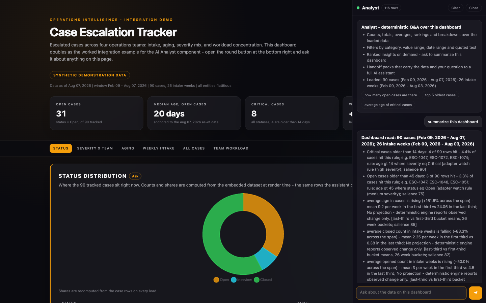

# AI Analyst Component — Architecture and Usage Guide

A guide to `ai-assistant.html`: a generic, self-contained, in-dashboard AI
analyst sidebar that can be dropped into any single-file HTML dashboard. It
answers questions about the data already loaded on the page — counts,
aggregates, rankings, breakdowns, trends, entity lookups — with zero network
calls, zero dependencies, and zero guessing. Works from `file://` on a
locked-down machine.



*Above: `ai-assistant-demo.html` with the sidebar open — the empty-state
capability card, and a "summarize this dashboard" answer that ranks adapter
watch rules first, cites its evidence, and labels the method on every insight.*

## What this is

The component is architected in three lanes:

| Lane | Name | Status | What it does |
|------|------|--------|--------------|
| 1 | Deterministic engine | Always on | Intent parser -> structured query -> query engine -> rendered answer. Pure client-side JavaScript over the rows the host dashboard declares. |
| 2 | Insight engine | Always on | Deterministic statistical salience: watch rules, concentration, outliers, trends, imbalance, staleness, data-quality caveats. Powers "summarize this dashboard" with evidence-backed answers, no model in the loop. |
| 3 | Handoff lane + optional provider | Handoff always on; provider off by default | Questions needing reasoning beyond the data (prediction, causation, judgment) get an honest refusal plus a one-click **handoff pack** — a markdown block carrying census, schema, data slice, question, and grounding contract, ready to paste into any full AI assistant. `AIA.registerProvider` optionally routes these to a live model instead. |

**The prime directive: never guess.** A wrong answer is worse than a refusal.
This shapes every surface:

- Low-confidence parses produce a clarification card, never an answer.
- Medium-confidence parses answer, but open by stating the assumption and
  offering alternatives.
- Questions outside the data produce a refusal that names what IS loaded and
  offers the handoff pack.
- Every answer carries a method footer — engine, rows scanned, rows matched,
  latency, null disclosures — so every number is auditable on sight.
- The insight engine has no RNG: same data, same output, formulas stated.

The result is an assistant that is honest-by-design: it computes what it can
compute, labels how it computed it, and refuses what it cannot — with a
productive escape hatch instead of a dead end.

## Package

| File | Role |
|------|------|
| [`ai-assistant.html`](ai-assistant.html) | The component, between extraction markers, plus an embedded self-demo so the file is try-able opened directly. |
| [`ai-assistant-demo.html`](ai-assistant-demo.html) | Full worked integration: a synthetic Case Escalation Tracker dashboard with the component installed the way a real integration looks. |
| `standalone/dashboard-ai-assistant.md` | Paste-prompt instructing any AI assistant to integrate the component into an existing dashboard. |
| This guide | Architecture, adapter reference, behavior contract, QA checklist. |

## Quick start

### Try the self-demo

Open `ai-assistant.html` directly in a browser (no server needed). The file
carries 36 synthetic review-queue records (`REC-001`..`REC-036`) and a working
`AIA_CONFIG`. Click the round button at bottom right and try:

- `how many open records are there`
- `top 5 records by value`
- `breakdown by category`
- `summarize this dashboard` — watch-rule hits rank first, then the seeded
  Payments concentration, the REC-005 outlier, the rising intake trend, and a
  null-rate caveat on `value_usd`
- `show me remediation backlog` — a refusal that names `remediation` as absent

The demo data is deliberately seeded so both watch rules fire and every insight
type has something to find.

### Integrate into a host dashboard

Six steps. The standalone prompt automates them; this is the manual path.

1. **Extract the block.** Copy everything between these two exact marker lines
   (each appears exactly once in the file, outside the intro card's escaped
   quotations):

   ```
   <!-- ===== BEGIN AI ANALYST COMPONENT v1.0 (self-contained: style + markup + script) ===== -->
   <!-- ===== END AI ANALYST COMPONENT ===== -->
   ```

2. **Install it** just before the host dashboard's closing `</body>` tag. The
   block is self-contained — style, markup, and script. Do not edit inside it.

3. **Author `window.AIA_CONFIG`** in a `<script>` placed BEFORE the component
   block. Declare your datasets, fields, measures, dimensions, and vocabulary
   (full reference below). `AIA.inferSchema(rows)` produces a best-guess
   fields map to start from — review its output, never trust it blind.

4. **Wire section asks.** Map DOM ids of dashboard sections to questions in
   `sectionAsks`; the component renders a small `Ask` chip next to each, which
   opens the panel and runs the question.

5. **Validate.** In the browser console run `AIA.validateConfig()` and fix
   every error and warning. The header status dot shows the same verdict:
   green clean, amber warnings, red errors.

6. **Run the acceptance tests** (QA checklist below) against your own data.

The component auto-initializes on `DOMContentLoaded`. Namespaces are strict:
config `window.AIA_CONFIG`, runtime API `window.AIA`, CSS classes `aia-*`,
CSS custom properties `--aia-*`, storage key `aia_state_v1::<title>` — no
collisions with host-page code.

### Public API

| Member | Signature | Purpose |
|--------|-----------|---------|
| `AIA.version` | `'1.0'` | Component version string. |
| `AIA.init()` | `() -> void` | Boot (idempotent; runs automatically on DOMContentLoaded). |
| `AIA.ask(q)` | `(string) -> void` | Programmatically submit a question. |
| `AIA.open(bool)` | `(boolean?) -> void` | Open/close the panel; no argument toggles open. |
| `AIA.injectAsks()` | `() -> void` | Re-render `Ask` chips (call after dynamic DOM changes). |
| `AIA.validateConfig()` | `() -> {ok, errors[], warnings[]}` | Validate the adapter (also runs on boot). |
| `AIA.inferSchema(rows)` | `(object[]) -> fields map` | Best-guess field typing from a value census. |
| `AIA.registerProvider(p)` | `({label, ask}) -> void` | Register the optional live-model lane. |

## Adapter reference — `window.AIA_CONFIG`

Examples below lift from the self-demo's review-queue domain.

### Top level

| Key | Type | Required | Example |
|-----|------|----------|---------|
| `title` | string | Yes | `"Review Queue Demo"` — used in the handoff pack header and the storage key. |
| `accent` | CSS color | No (default `#6366f1`) | `"#f59e0b"` — set on `--aia-accent` at boot. |
| `assistantName` | string | No (default `"Analyst"`) | `"Analyst"` — panel header name. |
| `datasets` | object, 1+ entries | Yes | See below. |
| `glossary` | object term -> definition | No | `{ "aging": "days elapsed since a record was opened" }` — matched terms surface the definition in answer evidence. |
| `watchRules` | array | No | See below — domain thresholds the insight engine checks first. |
| `suggestedQuestions` | string[] | No | `["how many open records are there", "breakdown by category"]` — empty-state chips. |
| `sectionAsks` | object DOM id -> question | No | `{ "demo-records": "Which records carry the highest value, and who owns them?" }` |

### Per dataset (`datasets.<key>`)

| Key | Type | Required | Example |
|-----|------|----------|---------|
| `label` | string (plural noun) | No (falls back to key) | `"records"` — used in sentences: "17 records match". |
| `rows` | array of flat objects | Yes | `[{record_id:"REC-001", category:"Payments", ...}, ...]` |
| `fields` | object field -> spec | Yes | Every queryable field must be declared; undeclared row fields draw a warning. |
| `entityField` | string | No | `"record_id"` — enables `details on REC-005`. Without it, entity lookups are disabled (warning). |
| `dateField` | string | No | `"opened"` — enables trends and recency. Without it, time questions are unavailable for the dataset (warning). |
| `measures` | string[] | No | `["value_usd"]` — numeric fields meaningful to aggregate. |
| `dimensions` | string[] | No | `["category", "priority", "owner", "status"]` — categorical fields meaningful to group by. |

### Per field (`fields.<name>`)

| Key | Type | Required | Example |
|-----|------|----------|---------|
| `label` | string | No (falls back to key) | `"value"` |
| `type` | `id \| category \| number \| date \| text \| boolean` | Yes | `"number"` |
| `aliases` | string[] | No | `["amount", "exposure"]` — extra vocabulary the parser recognizes. Aliases must be unique across a dataset's fields (duplicate = boot error). |
| `unit` | string | No | `"USD"` — enables unit-aware range filters ("over 25,000 USD"). |
| `order` | string[] | No | `["Low", "Medium", "High"]` — declares an ordinal category; lets the insight engine flag an empty extreme bucket. |

### Watch rules (`watchRules[]`)

| Key | Type | Required | Example |
|-----|------|----------|---------|
| `label` | string | Yes | `"High-priority records above 25,000 USD"` |
| `dataset` | string (dataset key) | Yes | `"records"` |
| `severity` | `high \| medium \| low` | Yes | `"high"` — sets insight salience 90/75/60. |
| `where` | `{field, op, value}` | No | `{ field: "priority", op: "eq", value: "High" }` — pre-filter. |
| `test` | `{field, op, value}` | Yes | `{ field: "value_usd", op: "gt", value: 25000 }` — the threshold each filtered row is tested against. |

`op` vocabulary: `eq | ne | gt | gte | lt | lte | contains | in`. Malformed
rules are skipped with a warning, never a crash.

### Validation

`AIA.validateConfig()` runs on boot; results drive the header status dot and a
boot card in the panel so a broken integration is never silent.

| Verdict | Conditions |
|---------|------------|
| Error (red dot) | Missing `title`; missing/empty `datasets`; rows not a non-empty array of plain objects; missing `fields` map; a declared field absent from more than 80% of rows; a measure/dimension/`entityField`/`dateField` referencing an undeclared field; an alias claimed by two fields. |
| Warning (amber dot) | No `entityField`; no `dateField`; no `suggestedQuestions`; fields present in rows but undeclared (listed by name); malformed watch rules. |

`AIA.inferSchema(rows)` type-detects by value census: dates parseable under
the date contract below -> `date`, all-numeric -> `number`, true/false ->
`boolean`, low cardinality (<= 20 distinct or <= 30% of rows) -> `category`,
unique-ish short strings -> `id`, else `text`.

### Date format contract (data prep)

The engine parses exactly two date formats, both as UTC: ISO `YYYY-MM-DD`
(prefix match, so ISO timestamps pass) and `M/D/YYYY`. Numeric values pass
through as epoch milliseconds. There is **no `Date.parse` fallback** — it is
engine- and timezone-dependent, which would break "same data, same output".
Anything else counts as a **date-null**: it is excluded from trends, recency,
and time filters, disclosed in null footers, and when more than 2% of a
declared date field's non-null values fail to parse, the insight engine raises
a type-conformance caveat naming the field and count. Adapters must normalize
date columns to one of the two formats before declaring the field as `date` —
this is the data-prep contract, not a suggestion.

## Engine reference

### Question types (Lane 1)

All ops accept filters, and every answer ends with a method footer of the form
`deterministic engine | scanned 36 rows | matched 17 | 0 ms`, plus per-field
null disclosures when any filtered field had nulls.

| Op | Trigger phrasings | What you get back |
|----|-------------------|-------------------|
| `count` | "how many", "number of", "count" | Integer, plus per-dimension counts when a dimension is named. |
| `aggregate` | "total", "sum", "average", "mean", "median", "min", "max" | Value + n + null-count disclosure on the measure. When every matching row is null on the measure, the engine refuses to compute — no `Infinity`, no fabricated 0. Naming a categorical field as the target ("average status") goes LOW with two chips: breakdown by that field vs the aggregate of a real measure. |
| `rank` | "top 5", "highest", "most", "bottom", "lowest", "longest", "shortest" | Top/bottom-N table of rows by measure, or of groups by count. |
| `distribution` | "breakdown by X", "split", "per", "share", "mix" | Group table: count + share % + optional per-group measure average, sorted descending. Shares use largest-remainder rounding in tenths, so the displayed column sums to exactly 100.0. |
| `list` | "list", "show me", "which", "find", "filter" | Filtered rows, 50 displayed, full count stated, CSV offered for the rest. |
| `detail` | "details on REC-005", "tell me about", "lookup" | Field:value card via substring match on `entityField`; 2-8 matches -> disambiguation chips; more than 8 -> narrow prompt; text-search fallback. |
| `compare` | "compare X vs Y", "difference between" | Two-column table: count plus avg/total per measure for each side. |
| `trend` | "trend", "over time", "by month", "getting worse" | Bucketed series (day when span <= 42 days, week <= 270, else month) with an ASCII `#` sparkline column and a direction verdict. Empty periods are zero-filled; measure buckets with no non-null values render `-` and are excluded from the verdict (nulls disclosed in the footer, and a comparison third that is all-null yields "No direction verdict" instead). A zero first-third baseline gets distinct wording with the absolute change, never a percent over zero. |
| `recency` | "recent", "latest", "newest", "oldest", "stale" | Newest/oldest N rows by `dateField`. |
| insight | "summarize", "most important", "anomalies", "outliers" | Lane 2 output (below). |
| meta/help | "help", "what can you do", "what data do you have" | Capability bullets + data census. |
| export | "export", "csv", "copy", "handoff" | Acts on the last data answer. A typed "handoff" packs the last data question and its parse — never the export command itself. |

Where the lexicon overlaps: "oldest"/"newest" route to `recency` (date-based);
"longest"/"shortest" route to `rank` on the default measure; "top N oldest"
resolves to recency.

### Filters

| Filter | Phrasings |
|--------|-----------|
| Category eq/in | Any declared category value, case-insensitive, prefix match ("payments", "sanction"). |
| Number range | "over / above / more than / at least N", "under / below / less than N" — unit-aware ("over 25,000 USD" binds to the USD measure). Comma-grouped numbers parse correctly ("over 20,000" is one number, not two). |
| Time window | "last N days/weeks/months/years", "today", "this week/month/year", bare year mentions ("2026"), and "since/before <year>" or "since/before <month>" — a bare month is pinned to the most recent matching year in the data. |
| Text contains | Quoted text, or "containing X", on `text`-typed fields only. A quoted term that cannot bind to a text field or an entity lookup is never silently dropped — it goes LOW with a clarification naming the term. |

Note on time anchoring: calendar phrases — "today", "this week", "this month",
"this year" — use wall-clock calendar semantics. "last N days/weeks/months/
years" anchors to the dataset's **newest data date**, so a dashboard with
static embedded data remains answerable indefinitely and results stay
deterministic. **Both anchors are disclosed**: every time-windowed answer's
trace states either `window anchored to the current date (...)` or `window
anchored to the newest data row (...)`, so the reader never has to guess which
clock applied.

### Confidence tiers — when it answers, assumes, or refuses

| Tier | Conditions | Behavior |
|------|-----------|----------|
| HIGH | Op resolved, all field/value references resolved, token coverage >= 0.75 | Answers directly. |
| MEDIUM | Coverage 0.5-0.75, or any defaulted slot (e.g. assumed measure) | Answers, but opens with `Assuming {assumption} - say "no" or pick an alternative below if that is wrong.` plus alternative chips. Standing assumptions persist across follow-ups as MEDIUM — carried forward disclosed each turn, never silently baked in. A defaulted rank/recency size appears in the trace as `n defaulted to 5`. |
| LOW | No op resolved, unknown load-bearing token, ambiguous dataset, missing required slot (no measure/dimension/dateField for the op), competing interpretations, an unbound quoted term, or an aggregate aimed at a categorical field | **Never renders an answer.** Clarification card: what was understood, what could not be placed (unknown tokens named verbatim: `I do not see anything called "remediation" in the data on this dashboard.`), 2-4 clickable disambiguation chips. A token matching a row field that exists but is undeclared gets its own honest phrase: the field is named as present in the rows but not declared to the assistant, with the fix (declare it in `AIA_CONFIG` fields). |

Coverage = matched significant tokens / total significant tokens (stopwords
excluded). **Competing interpretations go LOW, never a coin flip:** when a
question supports more than one reading at effectively equal coverage (the
alternate reuses the same matched tokens, so it always lands inside a 0.15
coverage band of the chosen parse), the card presents each reading as a
clickable chip. Three families trigger this: op ties, rank-vs-distribution
flips ("most records by owner" clarifies with `top 5 records by owner` vs
`breakdown by owner`), and measure role flips when two measures are candidates
for the same slot.

Follow-ups ("same but only high severity") inherit the previous
parse, patch it, and trace `(inherited from previous question)`. Hardening
rules keep this honest: a follow-up must contribute at least one recognized
element, an inherited parse containing an unknown load-bearing token stays
LOW — so "what about the big ones" clarifies instead of silently re-running —
and inherited parses run the same slot-filling and precondition gates as fresh
ones, with the prior turn's standing assumptions carried forward disclosed
(the answer stays MEDIUM while any assumption stands).

Judgment, prediction, and causation questions ("why is X behind", "predict
next month") are Lane-3-shaped: the engine refuses with
`That calls for reasoning beyond the loaded data, and I do not fake that.`
and offers the deterministic read plus the handoff pack.

### Insight engine (Lane 2)

`summarize` renders a census line, then the top insights ranked by salience
(0-100), then caveats. `most important` renders the single top insight plus
two "Also notable". Zero RNG — same data, same output. Each insight carries a
headline, evidence bullets with the actual numbers, and a method one-liner.

| # | Type | Method one-liner | Salience |
|---|------|------------------|----------|
| 1 | Watch-rule hits | Adapter-declared domain threshold, rows counted | 90 / 75 / 60 by severity, +5 when the hit share exceeds 10% — always ranked first; domain thresholds outrank statistics |
| 2 | Concentration | Top-1 group share vs uniform expectation | 40 + 60 x scaled excess of top-1 share over 1/k; floored at 0 under 3 groups |
| 3 | Outliers | z-score vs mean/sd at n >= 12 (threshold \|z\| >= 2.5); IQR fence (1.5xIQR) at 5 <= n < 12; rows named | 45 + 10 x (\|z\| - 2.5), capped 85 |
| 4 | Trend | Mean of last third of buckets vs first third; needs >= 6 buckets and \|delta\| >= 15%; "No projection - deterministic engine reports observed change only." | 40 + min(45, \|delta%\| / 2) |
| 5 | Imbalance / absence | Category far below uniform expectation, or an ordinal extreme bucket empty | 35-55 |
| 6 | Recency / staleness | Newest-row age vs today, plus the oldest-decile share with the cutoff date named | 30-50 |
| 7 | Data-quality caveats | Null rates > 5%, duplicate entity ids, and type-conformance failures > 2% of non-null values on declared number/date fields (caveat names the field and count) — always phrased as caveats, listed last | 25 + failure rate %; caveats at salience >= 50 get promoted into the main ranking; a measure with > 25% nulls also annotates every insight that leaned on it |

### Tone and phrasebook

Every user-facing string routes through a single `PHRASE` table (164 keys) via
`ph(key, vars)`, so all deployments speak in the same senior-analyst register:
direct, dense, no filler, no exclamation marks, no emojis. Copy edits happen in
one place.

## UI shell

What the component puts on the page, and the knobs a host has:

| Surface | Behavior |
|---------|----------|
| FAB | 54px round button, bottom right, accent gradient, inline SVG spark glyph (no emojis anywhere in the component). Toggles the panel. Shell wiring happens before the config check, so even with `window.AIA_CONFIG` entirely missing the FAB works and opens a visible boot-error card — a broken integration never presents as a dead button. |
| Panel | Right-side slide-in, `width: min(440px, 100vw)`, full height, glass background, `z-index` 9990/9991. Full width at <= 700px; renders correctly from 360px up. Closed state is `visibility: hidden` (plus `aria-hidden`), so an off-screen panel contributes nothing to the tab order. |
| Header | Status dot (green/amber/red from validation), assistant name, row-census chip, Clear, Close. A provider pill appears only when a live provider is registered. |
| Thread | User bubbles right, answer cards left. Card anatomy: headline, bullets, scrollable table (sticky header, right-aligned numerics), trace footer (`understood: ...`), method footer, action row, up to 3 follow-up chips generated from the parse. |
| Input | Textarea — Enter sends, Shift+Enter inserts a newline; disabled while busy; CSS-only three-dot thinking indicator. |
| Accessibility | Panel `role="dialog"` with `aria-label`; FAB labeled; Esc closes with focus returned to the FAB; focus moves to the textarea on open; all chips are real `<button>` elements. |
| Persistence | Last 40 thread entries + panel-open state in localStorage under `aia_state_v1::<title>`. Storage failures are silently ignored (private mode safe). Clear wipes storage and re-renders the empty state. |

### Theming

All colors route through `--aia-*` custom properties with dark defaults and a
`prefers-color-scheme: light` override block. The host can re-theme by
overriding any `--aia-*` variable on `:root`; the config `accent` is applied
to `--aia-accent` at boot via `style.setProperty`. No component style leaks
into the host page — every class is `aia-`-prefixed.

## The handoff pack (Lane 3)

The handoff pack is what makes the "cannot answer honestly" path genuinely
useful: instead of a dead-end refusal, one click copies a markdown document
that any full AI assistant (Claude, Copilot, ChatGPT) can answer WITH
grounding. Use it whenever a question needs external knowledge, causation, or
free-form judgment — or whenever you want a second opinion with the data
attached.

Contents, in order (six parts, exactly):

| Part | Content |
|------|---------|
| Header | `# Analyst handoff pack - {title} ({date})` |
| Context | One paragraph: what the dashboard is, generated by component v1.0. |
| `## Question` | The question verbatim, plus the last 4 thread turns as context. |
| `## Data census` | Census line, per-dataset schema tables (field / type / notes incl. units, aliases, ordinal order), date spans, glossary. |
| `## Relevant data slice` | Follows the packed question's OWN parse: if that parse carries filters or a timeframe — including a refused or LOW parse, and thread context inherited from earlier turns — those filters select the slice, rendered as CSV-in-fence, capped at 200 rows with truncation stated. Falls back to the last executed data parse, then to per-dimension distribution tables plus full rows when a dataset is <= 200 rows. |
| `## Response contract` | Five grounding bullets for the receiving model: ground every number in the slice and cite rows; distinguish computed fact from interpretation and state assumptions; no fabricated values, rows, or trends; the slice may be partial (cap stated); answer as a senior analyst, no emojis. |

The receiving-model contract is the point: the pack is engineered so the model
on the other end cannot plausibly fabricate — the data is present, the cap is
disclosed, and the register is specified.

Other exports, from any answer's action row:

| Action | Behavior |
|--------|----------|
| Download CSV | Blob download named `{title-slug}-{op}-{yyyymmdd}.csv`, RFC-4180 quoting. |
| Copy as markdown | Headline, bullets, table as GitHub markdown; `execCommand` fallback when `navigator.clipboard` is unavailable on `file://`. |

Typing an export command ("csv", "copy", "handoff") acts on the last data
answer; a typed "handoff" packs the last data question and its parse, never
the export command itself.

## Optional live-model lane

The component ships with **no provider and never phones home** — there is not
a single `fetch`, XHR, or WebSocket in the block. An environment that has a
live model endpoint can opt in:

```js
AIA.registerProvider({
  label: "In-house LLM",                 // shown as a header pill
  ask: async function (payload) { ... }  // returns a JSON action object
});
```

Payload: `{question, history, census, schema, queryEngine}` — `queryEngine` is
a callable that executes a structured query object through the same
deterministic engine. On the second pass the payload also carries
`queryResults`.

The provider must respond with exactly one action per response:

| Action | Shape | Component behavior |
|--------|-------|--------------------|
| `answer` | `{"action":"answer","headline":"...","bullets":[...],"sources":[...],"followups":[...]}` | Rendered with the provider label in the method footer, after grounding enforcement. |
| `query` | `{"action":"query","queries":[{op,dataset,...} x<=4],"note":"..."}` | Component executes up to 4 queries through the SAME deterministic engine, then re-calls the provider with the results. Two-pass cap — a second `query` action is not honored. |
| `clarify` | `{"action":"clarify","question":"...","options":[...]}` | Rendered as a clarification card with chips. |
| `refuse` | `{"action":"refuse","reason":"..."}` | Rendered as a refusal. |

Enforcement the provider cannot opt out of:

- **Grounding.** Every number in an `answer` (headline + bullets) is checked
  by substring match — formatted and raw forms — against the census and query
  results. Failures render a visible `unverified` chip on the answer. To verify
  it yourself: register a stub provider whose answer contains a number absent
  from the census (say `4,242`) and confirm the chip renders.
- **Timeout.** 60 seconds, then the deterministic engine answers instead, with
  the footer noting `provider timeout - deterministic engine answered`.
  Provider errors and malformed responses fall back the same way.

## QA checklist

The 14 acceptance tests, adapted to any host dashboard. Run them in a browser
after integrating; every one should pass before you ship.

| # | Test | Pass condition |
|---|------|----------------|
| 1 | Ask a count matching a KPI on the page ("how many open cases") | Exact count matches the dashboard's own number. |
| 2 | "top 5 oldest {rows}" | 5 rows, correct order, CSV download works. |
| 3 | "breakdown by {dimension}" | Distribution table with shares summing to exactly 100.0% (largest-remainder rounding). |
| 4 | Filtered aggregate ("average {measure} of {category} rows") | Correct value; nulls disclosed in the footer if any. A "last N days" variant states its anchor (the newest data date) in the trace; a "this week/month/year" variant states the current-date anchor. |
| 5 | "trend of {series}" | Direction verdict matches a pattern you know is in the data. |
| 6 | "summarize this dashboard" | Census + 4 or more ranked insights; watch-rule hits first; known concentration/outlier/trend present; caveat notes any null rate. |
| 7 | Ambiguous follow-up ("what about the big ones") | Clarification card, NOT an answer. |
| 8 | Unknown term ("show me remediation backlog"), then the same term quoted ("show me \"remediation\" records") | Refusal/clarification naming the term verbatim in both forms — a quoted term that binds to no text field or entity is never silently ignored. Available fields listed, handoff offered. |
| 9 | Judgment/prediction ("why is X behind", "predict next month") | Lane-3 refusal wording; handoff pack copies and contains census + slice + contract. |
| 10 | After test 3, "same but only {category-value}" | Inherited parse, trace shows the inheritance, correct filtered table. |
| 11 | "details on {entity-id}"; then a partial id with multiple hits | Detail card; disambiguation chips on the partial. |
| 12 | Hygiene sweep | Zero console errors; zero network requests from the component; reload restores the thread; Clear empties it; Esc closes the panel and returns focus to the FAB; light-mode render is legible. |
| 13 | `AIA.validateConfig()` | Returns `ok: true` on the real config; breaking a field name in a scratch copy surfaces a red-dot boot error. |
| 14 | Date conformance | Every value in each declared `date` field is ISO `YYYY-MM-DD` or `M/D/YYYY`. If "summarize" raises a type-conformance caveat on a date field, normalize the source data rather than shipping the caveat. |

## Troubleshooting

| Symptom | Likely cause | Fix |
|---------|--------------|-----|
| Red status dot on boot | `AIA_CONFIG` failed validation — missing title/datasets, declared field absent from rows, measure/dimension/entityField/dateField pointing at an undeclared field, or duplicate aliases | Run `AIA.validateConfig()` in the console; the boot card in the panel lists the same errors verbatim. Fix each; errors are specific by dataset and field name. |
| Assistant clarifies or refuses everything | Vocabulary gap: your users' words are not in the field labels/aliases or category values, so token coverage stays low and tokens read as unknown | Add `aliases` for the terms people actually use; add `glossary` entries for domain jargon; confirm category values in rows match what people say. The clarification card names the exact unplaced token — feed those back into the config. |
| Wrong numbers vs the dashboard | The dashboard renders from a different array than `AIA_CONFIG.rows` (two copies of the data drifted), or nulls are being counted differently | Point both the dashboard renderers and `AIA_CONFIG` at the same `const` (single source of truth). Check the footer's null disclosure — the engine excludes nulls from aggregates and says so. |
| Time questions unavailable or trends missing | No `dateField` declared (boot warning), or "last N days" seems off | Declare `dateField`. Remember "last N days" anchors to the dataset's newest date by design while "today"/"this week/month/year" use the wall clock — the answer trace names which anchor applied, so read it before assuming a bug. |
| Trends empty or dates counted as nulls | Date values are not in ISO `YYYY-MM-DD` or `M/D/YYYY` — the engine has no `Date.parse` fallback, so other formats are date-nulls | Normalize the date column per the date format contract. The summarize caveat names the failing field and count when more than 2% of non-null values fail to parse. |
| Thread not persisting across reloads | localStorage unavailable (private mode, `file://` restrictions in some browsers), or the `title` changed — the storage key is `aia_state_v1::<title>`, so a retitle orphans the old thread | Storage failures are silently ignored by design; the assistant works statelessly. Keep `title` stable if thread continuity matters. |
| `Ask` chips missing | Section ids in `sectionAsks` do not match DOM ids, or the sections render after boot | Verify ids; call `AIA.injectAsks()` after dynamic DOM injection. |
| Provider answers carry `unverified` chips | The provider stated numbers not present in the census or its query results | That is the grounding gate working. Have the provider use the `query` action to compute numbers through the deterministic engine instead of estimating. |

## Notes on spec deviations

Where the built component differs from the canonical spec, this guide
documents the code:

| Area | As built |
|------|----------|
| Size | Component block 141,388 bytes (~138 KB) vs the spec's 45-75 KB target; full file 153,493 bytes. Every mandated surface — full parser, 9 query ops, 7 insight types, provider loop, handoff generator, validation — plus the defect-fix hardening wave is implemented without stubs; the optimistic budget did not survive that. |
| Punctuation | Method footers and phrasebook strings use ASCII ` - ` and ` \| ` in place of the spec examples' em dashes and middots, per the all-ASCII rule. The page `<title>`/`<h1>` em dash is the file's only non-ASCII text. |
| Time anchoring | Calendar phrases ("today", "this week/month/year") use wall-clock calendar semantics; "last N days/weeks/months/years" anchors to the dataset's newest data date (static data stays answerable; deterministic results). Both disclose their anchor in the answer trace. |
| Date parsing | Only ISO `YYYY-MM-DD` and `M/D/YYYY` parse, both as UTC; the `Date.parse` fallback was removed as engine- and timezone-dependent. Unparseable values count as date-nulls and feed the type-conformance caveat. |
| Lexicon overlaps | "oldest"/"newest" -> recency; "longest"/"shortest" -> rank on the default measure; "top N oldest" -> recency. |
| Staleness insight | The spec's "share of rows older than P90 of date span" is degenerate as literally stated; implemented as newest-row age plus oldest-decile share with the cutoff date named, salience 30-50 as specified. |
| Follow-up hardening | Beyond the spec's letter: inheritance requires the follow-up to contribute at least one recognized element, and inherited parses containing unknown load-bearing tokens stay LOW. Both keep vague follow-ups clarifying instead of silently re-running. |

## Provenance

This pattern originated as the assistant sidebar in a personal music-library
intelligence dashboard and was genericized — schema-driven adapter, neutral
phrasebook, synthetic data — for reuse in any analytical dashboard.
