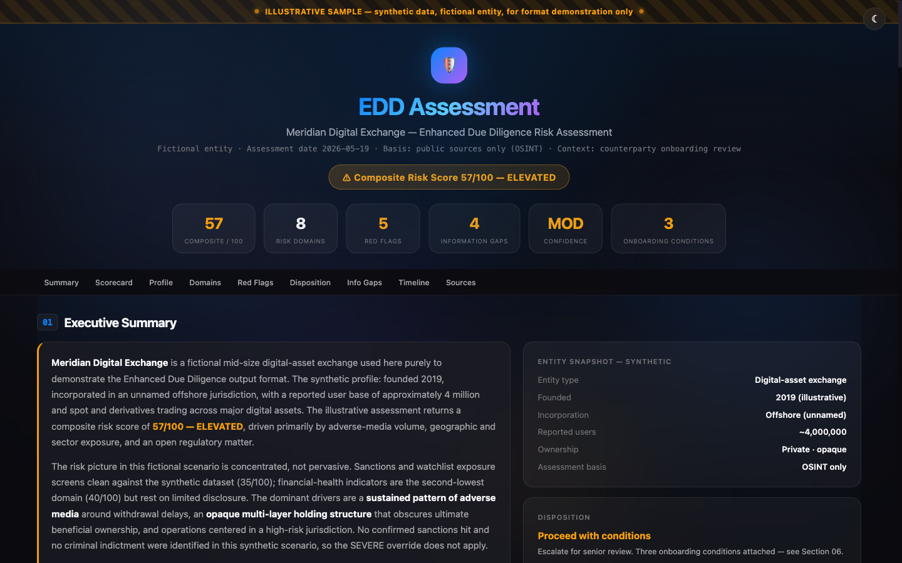

# Samples

Rendered example outputs — what the toolkit's prompts and templates actually produce.

> Every sample here is **illustrative**: synthetic data, and where an entity is assessed it is **fictional**. "Meridian Digital Exchange" is invented. These exist to show output format and quality, not to assess any real company.

---

## Interactive dashboards

### Enhanced Due Diligence dashboard
[`dashboards/edd-sample.html`](dashboards/edd-sample.html) — the output of [`prompts/compliance/enhanced-due-diligence.md`](../prompts/compliance/enhanced-due-diligence.md) rendered into the [Dashboard BIG](../output-templates/dashboards/) template. An 8-domain risk assessment of a fictional digital-asset exchange: weighted 0-100 composite, scorecard, radar and bar charts, per-domain narrative, red flags, disposition.

### Regulatory intelligence dashboard
[`dashboards/regulatory-landscape-sample.html`](dashboards/regulatory-landscape-sample.html) — a regulatory-landscape view rendered into the [3-tab deep-dive](../output-templates/dashboards/) template. Severity-tagged developments, a tracked-matters ledger, and upcoming deadlines for the digital-asset regulatory landscape.

> Both files are self-contained HTML — download and open in any browser; the only external dependency is the Chart.js CDN.

---

## Reports

| Sample | Produced by | What it shows |
|--------|-------------|---------------|
| [`reports/edd-sample.md`](reports/edd-sample.md) | [enhanced-due-diligence](../prompts/compliance/enhanced-due-diligence.md) | The same EDD assessment as a markdown report — the prose form of the dashboard above |
| [`reports/deep-research-sample.md`](reports/deep-research-sample.md) | [deep-research-storm](../prompts/research/deep-research-storm.md) | A cited, multi-section research article — *The Evolution of Stablecoin Regulation, 2022-2026* |
| [`reports/intelligence-brief-sample.md`](reports/intelligence-brief-sample.md) | [intelligence-brief](../prompts/briefs/intelligence-brief.md) | A morning anchor brief — prioritized, scannable, sourced |

## Compliance artifacts

| Sample | Produced by | What it shows |
|--------|-------------|---------------|
| [`compliance/control-matrix-sample.md`](compliance/control-matrix-sample.md) | [control-matrix](../output-templates/compliance-docs/control-matrix.md) | A populated AML/CFT control matrix — 10 controls across CDD, monitoring, sanctions, SAR, governance, with test results |

---

## How to read these

Each sample is the *result*; the linked prompt or template is the *input*. To reproduce: open the linked prompt, copy its prompt block, fill the placeholders, and run it in any capable AI assistant. The sample shows you the quality bar to expect — and the structure to hold the output to.
